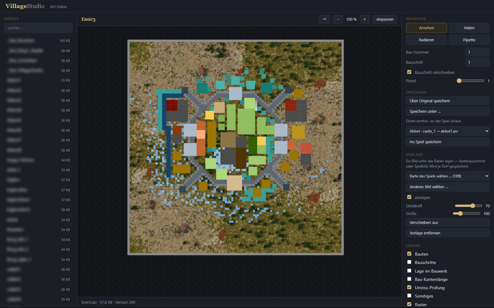

# Village Studio

Ein Editor für die KI-Dörfer (`.aiv`) von **Stronghold Crusader**.
Läuft im Browser, braucht nur Node — keine Installation, keine Fremdbausteine.

---

## Alpha. Bitte vorher lesen.

Dieses Werkzeug schreibt AIV-Dateien, die Stronghold Crusader lädt. Es
funktioniert bei mir, aber es ist jung und wenig erprobt.

* **Lege Sicherungen an.** Das Programm legt vor jedem Überschreiben selbst eine
  Kopie in `_backup` an — verlass dich trotzdem nicht allein darauf.
* **Getestet nur mit Stronghold Crusader und Crusader Extreme** unter Windows.
  Andere Teile der Reihe sind ungeprüft.
* **Rückgängig gilt nur, solange das Fenster offen ist.** Es gibt keinen Verlauf
  über Sitzungen hinweg.
* **Zwei Dinge im Dateiformat sind noch nicht verstanden** — sie stehen unten in
  der Todo-Liste. Dateien, die dieses Programm schreibt, sind deshalb nicht
  garantiert gleichwertig mit denen des Original-Editors.

---



*Das Original-KI-Dorf `Emir3`, darunter das Gelände einer echten Karte des Spiels.
Links die gefundenen Dörfer, rechts Werkzeuge, Speicherziele und Ebenen.*

---

## Starten

Node muss installiert sein ([nodejs.org](https://nodejs.org)).

```
node server.js
```

Dann [http://localhost:8790](http://localhost:8790) im Browser öffnen.
Unter Windows tut es auch ein Doppelklick auf `start.cmd`.

### Wo das Programm sucht

Am einfachsten: die `.aiv` in den Ordner **`aiv`** legen, der neben
`start.cmd` liegt, und die Seite neu laden.

Liegen die Dateien woanders, hilft in der linken Spalte der Abschnitt
**Eigene Ordner**: der Knopf *Ordner wählen …* öffnet den Windows-Dialog,
daneben lässt sich der Pfad auch eintippen. Ein so hinzugefügter Ordner wird
**samt Unterordnern** durchsucht — es genügt also, den Stronghold-Ordner
anzugeben, dann werden auch die AIV der UCP-Plugins gefunden.

Von allein gesucht wird außerdem in einem Ordner `Village` neben dem
Programmordner, im Programmordner selbst und im `aiv`-Ordner der
Spielinstallation. Findet das Programm gar nichts, zeigt es alle diese Orte
an. Alles lässt sich auch von Hand in eine `config.json` daneben schreiben:

```json
{
  "stronghold": "C:\\Program Files (x86)\\Steam\\steamapps\\common\\Stronghold Crusader Extreme",
  "doerfer": ["D:\\Meine AIV-Dateien"]
}
```

---

## Was heute funktioniert

Jede Zeile hier ist gemessen, nicht geplant.

**AIV-Dateien lesen** — alle 14 Abschnitte samt der PKWare-Implode-Packung.
An 152 Dateien geprüft, darunter alle 111 Originale des Spiels.

**AIV-Dateien schreiben** — gepackt zurück, mit automatisch neu berechneten
Abschnitten 2004 und 2005; die halten fest, wie die Felder eines Gebäudes
zusammengehören. Im Spiel bestätigt: eine geschriebene Burg wurde in einem Test
zu 445 von 450 Bauschritten gebaut.

**Anzeigen** — 100×100-Raster mit umschaltbaren Ebenen: Bauten, Bauschritte,
Lage im Bauwerk, Kantenlänge, Umriss-Prüfung. Zoom und Verschieben mit der Maus,
je Feld ein Hinweisfenster mit Nummer und Bauschritt.

**Gebäudenamen statt Nummern** — mit Größe und den drei verschiedenen
Nummernsätzen, die Stronghold für dasselbe Gebäude benutzt.

**Bearbeiten** — Malen, Radieren, Pipette, Pinselgröße 1 bis 7, Bauschritt
getrennt einstellbar, Rückgängig.

**Speichern an drei Stellen** — über das Original, unter neuem Namen, oder direkt
dorthin, wo das Spiel schaut (die `mapping.json` der UCP3-KI-Ordner). Immer mit
Sicherung.

**Karte als Hintergrund** — die Geländevorschau aus den `.map`-Dateien des
Spiels, senkrecht von oben, unter dem Raster. Alle 113 Karten des Spiels lesen
sich fehlerfrei; mit den Karten der Plugins findet das Programm 189. Alternativ
lässt sich ein eigenes Bild unterlegen.

**Spielgrafiken in der schrägen Ansicht** — statt farbiger Blöcke die echten
Bilder aus den `.gm1`-Dateien des Spiels, mit richtiger Verdeckung von hinten
nach vorn. Für 70 der 82 quadratischen Bau-Nummern ist das Bild zugeordnet und
Bild für Bild von Hand geprüft. Vier Darstellungen zur Auswahl: Spielgrafiken,
flach (Mauern, Türme, Tore und Bergfried liegen, der Rest steht), Grundriss
(alles flach, wie im alten Editor) und Klötze.

**Was das Spiel selbst dazumalt** — die Bodenplatten neben Bergfried, Kaserne,
Söldnerposten und den beiden Gilden; die Ausrichtung der Zugbrücke, aus der Lage
des Nachbartores gerechnet; die Treppenstufen als zweite Ebene; und für Häuser,
Gärten und Felder die Fassung, die das Spiel beim Bauen auswürfelt — hier fest
aus der Lage des Feldes gerechnet, damit sie beim Neuzeichnen nicht springt.

**Torhäuser drehen** — Taste `R` auf dem zuletzt berührten Feld tauscht die
beiden Ausrichtungen (40/41 und 42/43).

**Alles bleibt stehen** — Ansicht, Darstellung, Ebenen, Werkzeug, Zoom, Pinsel
und das zuletzt geöffnete Dorf überleben das Neuladen der Seite.

**Prüfblatt** unter `/pruefen.html` — je Bau-Nummer das zugeordnete Bild, drei
Knöpfe (*passt*, *sehe ich nicht*, *nicht vollständig*), ein Notizfeld und eine
ausziehbare Sammlung aller 549 Gebäudebilder zum Hineinziehen. So ist die
Zuordnung entstanden.

**Umriss-Prüfung** — meldet Felder, an denen die Zusammengehörigkeit nicht zu den
Bauten passt. Genau der Fehler, der ein 3×3-Gebäude in neun einzelne zerfallen
lässt.

---

## Was als Nächstes kommt

1. **Karte automatisch einrasten.** Dafür fehlt die Umrechnung zwischen dem
   Kachelgitter der Karte (80.400 Felder, keine Quadratfläche) und der Vorschau
   (200×200). Bis dahin legt man die Karte von Hand zurecht.
2. **Mauerwerk in Abschnitt 2004.** Dort steht mal 0, mal 1, und die Regel
   dahinter ist unbekannt. Zwei Erklärungen sind gemessen und widerlegt.
3. **Bauschritte durchspielen** — den Aufbau der Burg Schritt für Schritt ansehen
   wie einen Film.
4. **AIV im laufenden Gefecht tauschen**, ohne das Gefecht neu zu starten.
5. **Die restlichen 113 Abschnitte der `.map`** — bisher ist nur die Vorschau
   erschlossen.

---

## Dank

Die Beschreibung des AIV- und des Kartenformats stammt in Teilen vom
[Sourcehold-Projekt](https://github.com/sourcehold). Der Entpacker ist eine
Portierung von Mark Adlers `blast.c`.

## Lizenz

MIT — siehe [LICENSE](LICENSE).
